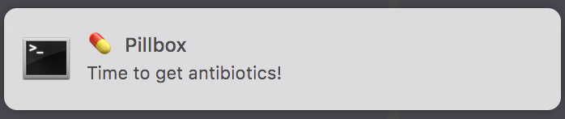

# 💊 Pillbox

[](https://goreportcard.com/report/github.com/fteem/pbox)

## What is this?

This is a CLI app written in Golang, that can be used to set medications reminders.
I hope you *never* use it, but if you are sick and you are taking meds, this
might help you remember when to take your meds. At least it helped me.

### ❗️ Important ❗️

Currently this works only on OSX, since it heavily relies on `launchd` for
management of the daemon. When I get the OSX support clean and shiny I will take
a look at GNU/Linux and Windows.

## Installation

```
go get github.com/fteem/pbox
```

That should do it.

## Usage

Pillbox is a package that allows you to set reminders for your medications. It
doesn't allow setting exact consumption times per medication, but it splits all
medication in three consumption times: morning (10:00h), afternoon (16:00h) and
evening (20:00h).

The notifications are in fact OSX notifications, shown using
[notify](https://github.com/martinlindhe/notify). They look like this:



### Installation

To install the `pillboxd` daemon, you need to run:

```
pillbox install
```

This will create a new `launchd` agent for your user, which will manage the state
of the daemon. The Property List (`.plist`) file will be located at `~/Library/LaunchAgent/com.ieftimov.pillbox.plist`.

There's no need to load the agent since the command will take care of that.
Post-install you should receive a notification that the daemon is started.

To check if the agent is running, run:

```
pillbox status
```

### Uninstallation

To completely remove the daemon you can run:

```
pillbox uninstall
```

That's it, no more reminders!

### Reminders management

To list all reminders, use:

```
pillbox reminders list
```

This will print out a table containing all of the active reminders:

```
+-------------+---------+-----------+---------+
| Name        | Morning | Afternoon | Evening |
+-------------+---------+-----------+---------+
| Probiotics  | Yes     | No        | No      |
| Antibiotics | Yes     | Yes       | Yes     |
| Brufen      | No      | No        | Yes     |
+-------------+---------+-----------+---------+
```

To add a new reminder, use:

```
pillbox reminders add Antibiotics [--morning] [--afternoon] [--evening]
```

This will set a reminder for `Antibiotics`, but it will require any of the three
flags to be set. If any of the flags are not present, it will fail with:

```
pillbox: error: Any (or all) of the --morning, --afternoon or --evening flags have to be present.
```

To remove a reminder, use:

```
pillbox reminders remove Antibiotics
```

## Contributing

Bug reports and pull requests are welcome on GitHub at https://github.com/fteem/pbox. This project is intended to be a safe, welcoming space for collaboration, and contributors are expected to adhere to the [Contributor Covenant](https://www.contributor-covenant.org/) code of conduct.

## License

The code is available as open source under the terms of the [MIT License](https://opensource.org/licenses/MIT).


